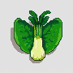
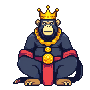
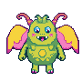
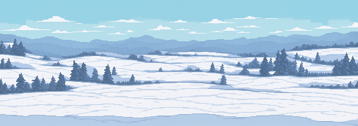

# Gamified Habit Tracker

Are you tired of the same old to-do lists? Do you want to gamify your life? Then this is the app for you!


## Installation

Note: This project requires both MongoDB and MySQL to be installed on your machine or you can use a cloud database service.

1. Clone the repository and install the dependencies.

```bash
git clone https://github.com/BetterACS/GHT.git
```

2. Setup your mysql database. using files in `backend/database` folder. and setup your mongodb database. using files in `backend/src/database/models.ts` folder.

3. You need to create file called `.env` inside the `backend` folder. This file should contain the following:

-   `MONGODB_URI`: The URI of the MongoDB database.
-   `MYSQL_HOST`: The host of the MySQL database.
-   `MYSQL_USER`: The username of the MySQL database.
-   `MYSQL_PASSWORD`: The password of the MySQL database.
-   `MYSQL_PORT`: The port of the MySQL database.
-   `MYSQL_DATABASE`: The name of the MySQL database.
-   `ACCESS_TOKEN`: The access token for the JWT.
-   `REFRESH_TOKEN`: The refresh token for the JWT.

Example:

```
MONGODB_URI = "mongodb://localhost:27017/ght"
MYSQL_HOST = "localhost"
MYSQL_USER = "root"
MYSQL_PASSWORD = "password"
MYSQL_PORT = "3300"
MYSQL_DATABASE = "ght"
ACCESS_TOKEN = "aCcE$s#S"
REFRESH_TOKEN = "r#E$fReSh"
```

4. Install dependencies, run the following commands:

```node
cd GHT/backend
npm run install
cd ../frontend
npm run install
```

or you can install all dependencies separately.

## Usage

To start the web application, you need to run these commands:

Start all the servers at once

```node
cd GHT
npm run all-dev
```

or you can start each server separately.

-   Start the backend | frontend | validate server

```node
npm run <server>
```

## Gameplay

You role-played as a young tamer who wants to become the best tamer in the world. You will be given a monster to tame. You can tame your monster by give it item (food).

Each time you complete a task, you will get a random item. You can view your items in the inventory.

### Default Items

Note: These are the default items. Made by Stable diffusion model.





Each monster has a different food preference. You need to give the monster the right food to tame it (Better chance).

### Default Monsters

Note: These are the default monsters. Made by Stable diffusion model.








Additional monster sprite:


### Default Backgrounds

Note: These are the default backgrounds. Made by Stable diffusion model.





